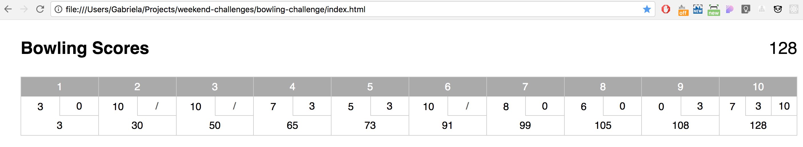
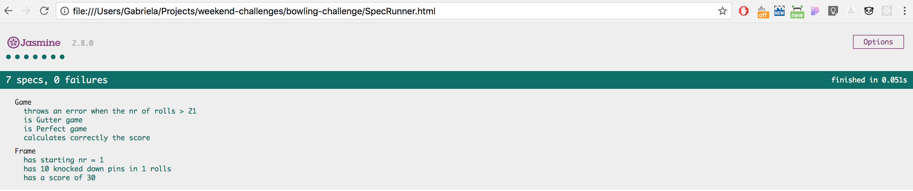

# Bowling Game Score Calculator
Bowling Game represents the implementation of Makers Academy weekend challenge of calculating the scores of a bowling game for one player (in JavaScript).

A bowling game consists of 10 frames in which the player tries to knock down the 10 pins. In every frame the player can roll one or two times. The actual number depends on strikes and spares. The score of a frame is the number of knocked down pins plus bonuses for strikes and spares. After every frame the 10 pins are reset.

## Approach
I have spent most of the time trying to find the best algorithm of calculating the score using arrays and iteration. I have then decided I initially need only two types of objects: Frame (state responsibility of storing the rolls and intermediary score) and Game (behaviour responsibility of computing the score). Edge cases such as gutter game or perfect game have also been implemented.

## Setup
- $ git clone https://github.com/gabrielabud/bowling-challenge.git
- $ open index.html
- $ open SpecRunner.html  -> to view tests

## Further improvements
If I had more time, I would have refactor the code having in mind the single responsibility and delegation e.g. taking some of the functionality of the Game object that updates the Frame or uses the roll data, and move it to the Frame.
